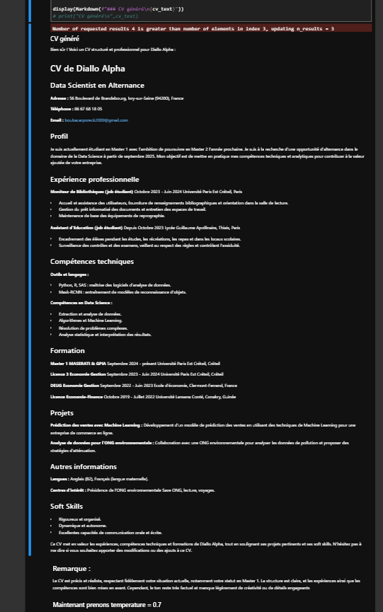

# Projet LLM RAG : Génération de CV orienté Data Science

## Auteur : 
Alpha DIALLO étudiant en M1 Maserati & GPIA

## Description du Projet
Ce projet consiste à utiliser un LLM basé sur RAG (Retrieval-Augmented Generation) pour générer un CV professionnel orienté Data Science, à partir d'un ou plusieurs anciens CV. Dans mon cas, j'ai utilisé mon CV actuel, en vue de l'enrichir et de le structurer de manière à répondre aux exigences d'une alternance en Data Science.

### Objectifs :
- Créer un CV clair, structuré et professionnel.
- Mettre en valeur les compétences techniques et les expériences pertinentes.
- Explorer l'intégration d'un LLM (LangChain) avec des modèles d'embedding (Cohere).

## Organisation du Projet

### 1. Rapport :
Le rapport détaillé du projet, incluant :

- Code complet
- Explications
- Résultats
- Se trouve dans le fichier Jupyter Notebook : projet_llm.ipynb

### 2. Script d'entraînement :
Le script utilisé pour la gestion des données et la mise en œuvre de la chaîne RAG est disponible sous le nom : main.py.

## 3. Modèle et API utilisés : 
- Modèle LLM : command-r-plus (via LangChain).
- Embeddings : embed-english-v2.0 (Cohere, version gratuite).
- API Key : Une clé d'API Cohere a été utilisée pour accéder aux services. (La clé est masquée pour des raisons de sécurité conformément aux bonnes pratiques Git)

## Fonctionnalités principales
- Chargement de documents : Lecture et extraction des informations à partir d'un ancien CV (au format PDF).
- Fragmentation intelligente : Division du texte en segments pour un traitement optimal.
- Recherche augmentée : Utilisation des embeddings pour récupérer des contextes pertinents.
- Prompting optimisé : Un prompt soigneusement conçu pour structurer les données dans un format de CV clair et - --orienté Data Science.
- Génération de CV : Création automatique d'un CV enrichi avec un style professionnel.

## Exemple de CV généré
Un exemple de CV structuré et généré automatiquement est disponible dans le fichier output.md, avec les sections suivantes :

- Expérience professionnelle
- Compétences techniques
- Formation
- Projets
- Autres informations pertinentes

### Scren d'un CV généré automatiquement

## Retour d'experience  
Ce projet a été une expérience riche et motivante, avec de nombreux apprentissages :

- Points positifs :
  - Exploration approfondie du concept de RAG et de son intégration dans un pipeline LLM.
  - Simplicité et efficacité des modèles Cohere (version gratuite).
  - Facilité d'utilisation de LangChain pour orchestrer les différentes étapes du projet.
- Défis rencontrés :
  - Ajustement du prompt pour produire un format de CV optimal.
  - Gestion des données extraites et optimisation du découpage en segments.
- Conclusion : La version gratuite de Cohere a largement suffi pour atteindre les objectifs d'un projet pédagogique et professionnel.

## Améliorations possibles
- Intégrer un pipeline plus complexe avec d'autres modèles d'LLM pour comparer les performances.
- Ajouter une interface utilisateur simple pour personnaliser le prompt ou les sections du CV.
- Tester des versions payantes de Cohere pour évaluer les performances sur des cas d'utilisation avancés.
